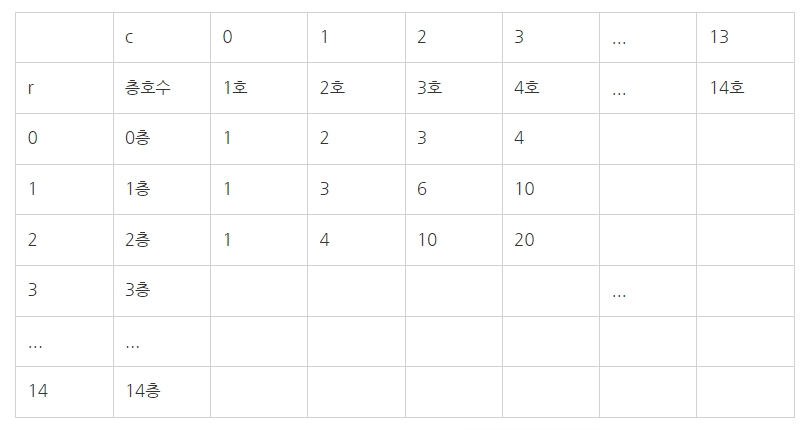

- 220719
## 백준 > Bronze1 > 2775번 : 부녀회장이 될테야
메모리 30840kb 시간76ms  
https://www.acmicpc.net/problem/2775  

코드
```python
t = int(input()) # 테스트 케이스 수
arr = [[0] * 14 for i in range(15)]
# 0층 1호 arr[0][0] 1명, 0층 2호 arr[0][1] 2명 ... 0층 14호 arr[0][13] 14명
for c in range(14):
  arr[0][c] = c + 1
# 1층 1호 arr[1][0] 1명, 2층 1호 arr[2][0] 1명 ... 14층 1호 arr[14][0] 1명
for r in range(15):
  arr[r][0] = 1
# k층 n호 = (k-1)층 n호 + k층 (n-1)호
for r in range(1, 15):
  for c in range(1, 14):
    arr[r][c] = arr[r-1][c] + arr[r][c-1]
for i in range(t): # 테스트 케이스 돌면서
  k = int(input()) # 입력 층수
  n = int(input()) # 입력 호수
  print(arr[k][n-1]) # 해당 층호수의 거주민 수 출력
```



입력
```
2
1
3
2
3
```

출력
```
6
10
```