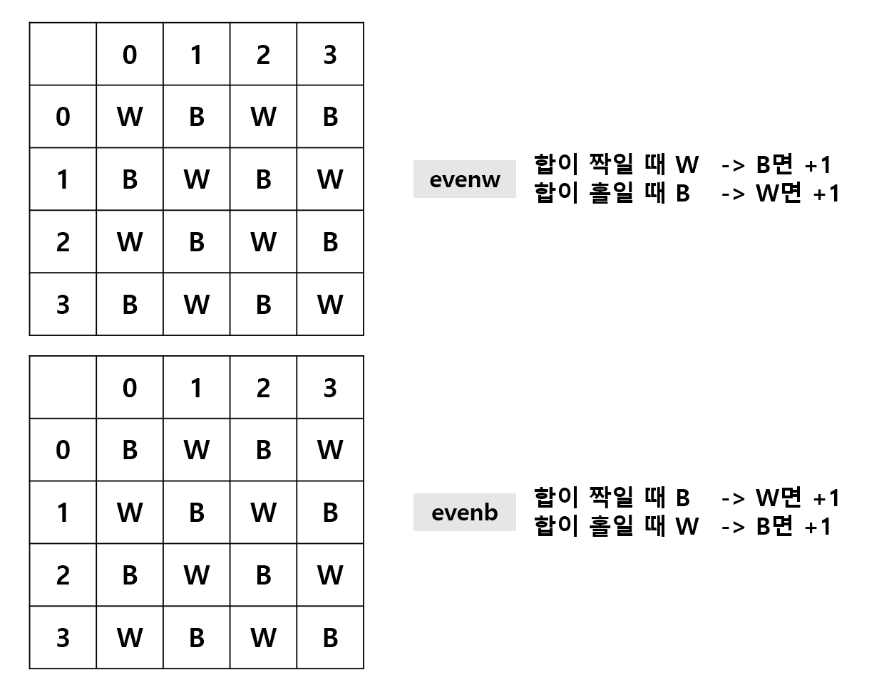

- 230130
##  백준 > Silver4 > 1018번 : 체스판 다시 칠하기
메모리 30616kb 시간 72ms  
https://www.acmicpc.net/problem/1018  


코드
```python
n, m = map(int, input().split()) # n행 * m열
mat = [[] for _ in range(n)]
for i in range(n):
  mat[i] = list(input()) # 주어진 체스판
ansli = []
for r in range(0, n-7): # 행 크기 8
  for c in range(0, m-7): # 열 크기 8 탐색 범위
    evenw = 0 # 행+열 합이 짝수인 곳 흰색으로 만들기
    evenb = 0 # 행+열 합이 짝수인 곳 검은색으로 만들기
    for i in range(r, r+8):
      for j in range(c, c+8):
        if (i+j)%2 == 0: # 합이 짝수라면
          if mat[i][j] == 'B': # 검은색이라면
            evenw += 1
          else: # 흰색이라면
            evenb += 1
        else: # 합이 홀수라면
          if mat[i][j] == 'B': # 검은색이라면
            evenb += 1
          else: # 흰색이라면
            evenw += 1
    ansli.append(min(evenw, evenb)) # 흰색 시작, 검은색 시작 중 최솟값 리스트에 담기
print(min(ansli)) # 8*8 탐색 후 리스트에 담긴 값 중 최솟값 출력
```

입력
```
11 12
BWWBWWBWWBWW
BWWBWBBWWBWW
WBWWBWBBWWBW
BWWBWBBWWBWW
WBWWBWBBWWBW
BWWBWBBWWBWW
WBWWBWBBWWBW
BWWBWBWWWBWW
WBWWBWBBWWBW
BWWBWBBWWBWW
WBWWBWBBWWBW
```

출력
```
15
```